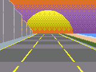
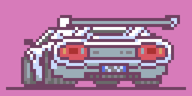

图片使用说明
==

场景
--
赛车场景由三层组成，图层从上到下为
- 玩家赛车 及 NPC，障碍物
- 道路
- 地面 *Ground.png*
- 天空 *Sky.png*

道路
--
道路分为5个素材

3个直行素材

- Left.png
- Mid.png
- Right.png

2个转弯素材
- M2L.png *中路到左路*
- M2R.png *中路到右路*

左右路到中路 只需要倒放转弯素材

赛车
--
赛车有3个素材
- 直行 *Straight.png*
- 左转 *TurnL.png*
- 右转 *TurnR.png*

